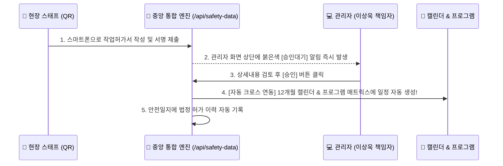

# 🏢 [스튜디오프리즘] 방송제작 안전관리 통합 플랫폼 운영 및 인수인계 가이드

**문서 번호**: PRISM-SAFETY-2026-DOC-01  
**최종 갱신일**: 2026년 9월 8일  
**작성 / 총괄책임자**: 안전관리본부 이상욱 책임자 (`e26e100` / 010-6670-3534)  
**시스템 명칭**: 스튜디오프리즘 방송제작안전관리 포털 (Studio Prism Safety Hub)

---

## 📌 목차
1. [시스템 개요 및 핵심 아키텍처](#1-시스템-개요-및-핵심-아키텍처)
2. [관리자 계정 및 보안 체계](#2-관리자-계정-및-보안-체계)
3. [주요 페이지 및 모바일 QR 직통 링크](#3-주요-페이지-및-모바일-qr-직통-링크)
4. [3대 핵심 자동 크로스 연동 엔진](#4-3대-핵심-자동-크로스-연동-엔진)
5. [일상 운영 및 현장 사용 매뉴얼](#5-일상-운영-및-현장-사용-매뉴얼)
6. [후임자 업무 및 시스템 인수인계 절차](#6-후임자-업무-및-시스템-인수인계-절차)
7. [비상 복구 및 3중 백업 안내](#7-비상-복구-및-3중-백업-안내)

---

## 1. 시스템 개요 및 핵심 아키텍처

스튜디오프리즘 안전관리 시스템은 SBS 예능 프로그램(`골 때리는 그녀들`, `런닝맨`, `우리들의 발라드` 등)의 방송제작 현장에서 발생하는 산업안전보건법 및 중대재해처벌법상 안전의무를 철저히 이행하고, 현장 작업허가서 및 위험제보를 실시간으로 통합 관리하는 플랫폼입니다.

* **프론트엔드/백엔드 프레임워크**: Next.js 14 App Router, TypeScript, Tailwind CSS
* **디자인 테마**: 클린 화이트 테마 & 스튜디오프리즘 고유 레드 포인트 컬러 (`#FF4B3E`)
* **데이터베이스**: 단일 중앙 무결성 저장소 (`Single Source of Truth`)
* **외부 기상청 연동**: Open-Meteo 한국 방송제작 거점(강화, 상암, 탄현, 목동, 가평 등) 실시간 기상 API

---

## 2. 관리자 계정 및 보안 체계

| 구분 | 관리자 정보 | 권한 및 역할 |
|:---|:---|:---|
| **총괄책임자 계정** | **아이디**: `e26e100` **소속**: 안전관리본부 **성명**: 이상욱 책임자 | **`SUPER_ADMIN`** • 모든 작업허가서 최종 승인 • 12개월 캘린더/프로그램 일정 총괄 관리 • 현장 위험제보 조치 및 서명 • 관리자 계정 추가/수정/삭제 전권 |

---

## 3. 주요 페이지 및 모바일 QR 직통 링크

| 메뉴명 | 화면 경로 / 엔드포인트 | 주요 기능 |
|:---|:---|:---|
| **🏢 종합 대시보드** | `/` | 승인대기 허가서, 위험제보 조치율, 프로그램별 안전현황 한눈에 요약 |
| **📅 12개월 캘린더** | `/calendar` | 작업허가서 승인 시 자동 연동되는 실시간 월간/일간 촬영 안전 캘린더 |
| **🎬 프로그램 관리** | `/programs` | 프로그램별 세부 고/중/일반 위험작업 매트릭스 및 TBM 상태 추적 |
| **📋 작업허가서 관리** | `/work-permits` | 현장 신청서 검토, 1초 원클릭 승인/반려, 작업허가서 A4 출력 |
| **📱 모바일 작업허가서 신청** | `/work-permit-apply` | 현장 스태프가 QR로 접속하여 실시간 날씨 연동 + 자필 서명 제출 |
| **📢 모바일 근로자 의견청취** | `/worker-report` | 현장 근로자 위험제보, 사진 촬영 첨부, 자필 서명 접수증 PDF 발급 |
| **✍️ TBM 모바일 서명** | `/tbm-sign` | 작업 전 안전점검(TBM) 참석자 명단 및 모바일 서명 |

---

## 4. 3대 핵심 자동 크로스 연동 엔진

본 시스템은 데이터가 따로 놀지 않도록 아래 3가지 자동 연동 엔진이 강력하게 작동합니다:

---

## 5. 일상 운영 및 현장 사용 매뉴얼

### 🖥️ 로컬 PC에서 켤 때 (원클릭 시작)
1. 바탕화면의 **`[스튜디오프리즘 안전관리시스템 시작.bat]`** 아이콘을 더블클릭합니다.
2. 약 2~3초 후 인터넷 브라우저(`http://localhost:3000`)가 자동으로 열리며 시스템이 가동됩니다.
3. 검은색 콘솔 창을 최소화해 두시면 PC와 모바일에서 계속 작동합니다.

### 📱 현장 스태프에게 QR 코드 전달할 때
1. 관리자 화면 우측 상단의 **`[📱 모바일 외부 접속]`** 버튼을 클릭합니다.
2. 화면에 뜨는 대형 QR 코드를 스태프에게 보여주거나, **`[복사]`** 버튼을 눌러 카카오톡 단체방에 전달합니다.
3. 현장 스태프가 제출하면 관리자 화면에 즉시 알림이 뜨므로 검토 후 승인해 주시면 됩니다.

### 🛑 시스템을 종료할 때
* 바탕화면의 **`[스튜디오프리즘 안전관리시스템 종료.bat]`**을 더블클릭하시면 모든 서버가 안전하게 종료됩니다.

---

## 6. 후임자 업무 및 시스템 인수인계 절차

### 👤 1단계: 후임자 관리자 계정 생성 및 전달
1. 사이트 접속 후 **[조직도]** ➔ **[계정 관리]** 메뉴로 이동합니다.
2. **`[+ 계정 추가]`**를 클릭하여 후임자의 아이디, 비밀번호, 성명, 연락처를 입력하고 권한을 `SUPER_ADMIN`으로 지정합니다.
3. 후임자에게 시스템 주소와 해당 아이디/비밀번호를 전달합니다.

### 💾 2단계: 소스코드 및 클라우드 계정 인계
1. 바탕화면에 있는 **`스튜디오프리즘_안전관리_완전백업.zip`** 파일을 후임자에게 USB 또는 회사 이메일로 전달합니다.
2. 클라우드 호스팅(Render/GitHub) 계정 정보를 사내 인수인계서에 기재하여 전달합니다.

---

## 7. 비상 복구 및 3중 백업 안내

혹시라도 시스템 파일에 문제가 생겼을 때를 대비하여 **3중 완전 백업**이 컴퓨터에 안전하게 보관되어 있습니다:

1. **📁 C 드라이브 원본 백업**: `C:\안전관리_완전백업_20260902`
2. **📁 바탕화면 소스코드 백업**: `바탕화면` > `스튜디오프리즘_안전관리_소스코드_완전백업`
3. **🗜️ 바탕화면 단일 압축 백업**: `바탕화면` > `스튜디오프리즘_안전관리_완전백업_20260902.zip` (18.09 MB)

> [!TIP]
> 복구가 필요할 때는 AI 코딩 어시스턴트에게 **"백업해 둔 걸로 복구해 줘"**라고 한마디만 말씀하시거나, 위 백업 폴더를 복사하시면 1초 만에 100% 원상 복원됩니다.
